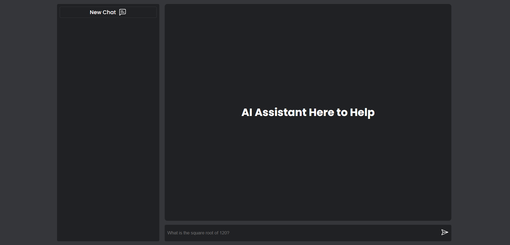

# AI Chat Application

A simple OPENAI chat application with a nice dark themed UI
Built with typescript, express and typeorm

### How to use

Clone this repository and navigate to it
```bash
git clone https://github.com/sammyl720/ai-chat.git
cd ai-chat
```

Install all dependencies
```bash
yarn install
```

Create a `.env` file and add your OPENAI secret key
```bash
echo "OPENAI_API_KEY=sk-..........." > .env
```

Optionally, you can add a `PORT` variable to the `.env` file to change the port which serves the application. The default port is `3000`.

Start the dev server
```bash
yarn run serve
```
Once the server is running you can navigate to [http:/localhost:3000](http://localhost:3000) or to the port you specified on your local machine to use the application.

You should be greeted with a simple and intuitive interface to prompt the AI assistant.


